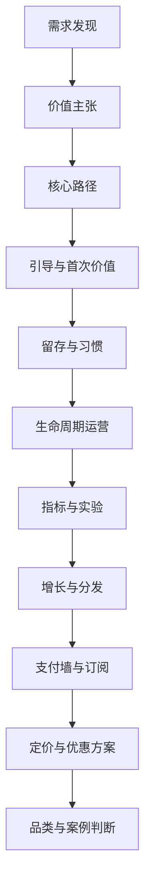

# Consumer Product Atlas | C 端产品经理知识总图

> 零基础先记住这一句：C 端产品经理真正管理的，不是一个页面或一个功能，而是一整条从价值到收入的连续链路。
> English takeaway: A consumer product manager works on a value chain, not a single screen.

## 为什么很多团队总在修错地方

消费级产品最常见的失败，并不是某一个按钮放错了，也不是某一屏设计得不够漂亮。它更像是一种连锁反应。用户为什么来，没有讲清；进来以后第一步做什么，没有压短；第一次结果来得太慢；刚刚有一点兴趣，就被权限、注册或支付请求打断。等问题一路传到后面，团队看到的往往只剩下“转化差”“留存低”“增长贵”这些症状。

这也是这张总图的起点。它不是后面各章的目录摘要，而是先帮读者把消费级产品重新看成一条完整价值链。只要你先接受这个前提，后面的判断就会稳很多。支付墙不是孤立的一屏，留存也不是一个孤立的曲线，增长更不是独立于产品之外的一套外部动作。它们都在同一条链路里互相传导。

## 这条价值链到底长什么样

一款消费级产品，通常会从需求发现开始。团队先要确认，用户到底在解决什么问题，那个问题值不值得被产品承接。接下来是价值主张，也就是把“我们能帮你什么”压缩成一句用户听得懂、也愿意相信的话。再往后是核心路径与信息架构，决定用户进来以后会不会立刻迷路。然后才轮到引导，帮助新用户在最短时间里摸到第一次可感知的结果。

第一次结果出现以后，产品还要继续回答另外几个问题。用户为什么愿意回来，回来以后为什么不是从零开始，关系运营怎样在合适的时候把人带回正确动作，指标和实验怎样帮助团队看清问题到底出在哪里。等这些基础站稳，增长才会更像放大器，而不是昂贵漏斗。最后，支付墙、定价和优惠方案才有机会把前面已经发生的价值转成稳定收入。

## 这本书真正有两条主轴

如果只抓最重要的结构，全书其实围绕两条主轴展开。第一条主轴是“价值怎样被建立”。它覆盖需求发现、价值主张、核心路径和引导。它要回答的是，用户为什么会来，进来以后怎样尽快看见价值，第一次结果为什么值得相信。第二条主轴是“价值怎样被放大”。它覆盖留存、生命周期、指标、增长、支付墙和定价。它要回答的是，已经发生过一次的价值，怎样变成重复使用、长期关系和持续收入。

这两条主轴不能拆开读。前半段没有讲清，后半段一定会越来越费力。你会看到团队不断用补丁去修问题，推送越来越多，试用越来越花，页面越来越会卖，但用户就是不稳定。很多时候，不是后半段做得不够，而是前半段根本还没有把价值站稳。

## 遇到问题时，先把它放回哪一段

这套书最适合的用法，不是从第一章开始死记，而是先学会定位。如果问题是“用户根本没被说动”，先去看需求发现和价值主张。如果问题是“用户进来以后不知道做什么”，去看核心路径和引导。如果问题是“体验过一次却不回来”，去看留存和生命周期。如果问题是“安装不少，但质量很差”，去看增长与分发。如果问题是“支付墙点击不差，但付费不稳”，就要一起看引导、支付墙和定价，因为那里常常不是某一屏的问题，而是理由链断掉了。

定位的意义很大。消费级产品的很多问题，表面出现在链路后段，真正原因却躲在前段。只要团队没有这种“把症状送回上游”的习惯，后面的每一次优化都可能只是在搬动数字。

## 这套书怎样读最顺

第一次读，最稳的顺序仍然是顺读。先看这张地图，再读基础卷，建立需求、价值主张和主路径的判断。然后进入引导、留存、生命周期和指标，知道一次使用怎样变成持续关系。最后读增长、支付墙和定价，理解分发和变现怎样接回前面的价值链。这样读的好处，是你不会把后面的章节误读成技巧合集。

如果你是带着具体问题来，也可以跳读，但跳读时最好把自己所在的问题重新放回这张总图。因为这套书不是在教你“哪个页面怎么抄”，而是在教你，消费级产品到底该怎样一步步看、怎样一步步诊断。

## 推荐体验 App 与体验任务

### ChatGPT
- 平台：iOS / Web
- 为什么推荐它：它能让你最快感受到“先看到价值，再理解结构”这条主线。
- 先体验哪一步：直接发一个你真会问的问题，例如“帮我做一个三天旅行计划”。
- 重点观察什么：它为什么几乎不解释自己，却能很快让你感到“这个东西有用”。
- 体验任务：
  - [ ] 记录你从打开到得到第一个可用答案花了多久。
  - [ ] 观察它有没有在你还没理解全部能力前，就先把价值做出来。

### Spotify
- 平台：iOS / Web / Android
- 为什么推荐它：它能帮助你理解内容产品怎样把供给、体验和订阅关系接成一条线。
- 先体验哪一步：先用免费层随便播放几首歌，再刻意观察会员入口。
- 重点观察什么：免费体验是否已经成立，以及它怎样把“更顺”翻译成付费理由。
- 体验任务：
  - [ ] 看第一屏最先告诉你的到底是内容、功能还是会员。
  - [ ] 记下你在哪个时刻第一次明显感到它在推会员。

### Duolingo
- 平台：iOS / Web / Android
- 为什么推荐它：它几乎是一整本书里“引导、留存、习惯、付费”连起来看的典型样本。
- 先体验哪一步：完整走一遍首次语言选择与第一节课。
- 重点观察什么：它怎样让长期目标变成今天就能开始的小动作。
- 体验任务：
  - [ ] 记录首次练习完成前，它一共向你索取了哪些信息。
  - [ ] 观察它在什么时候开始把“连续使用”变成一个可见承诺。

## X 与论坛原话

### 1. Nikita Bier：先建立可重复的验证系统

**为什么这条帖值得放进本章**

这条长线程对应总图章最重要的判断。消费级产品不是靠一次灵感取胜，而是靠一套能不断发现问题、测试路径、修正判断的系统。

**原帖原话**

> "A reproducible testing process is more valuable."

**中文解释**

这句话把总图章的前提说得很直白。真正值得经营的，不是一堆零散技巧，而是一条能持续验证整条价值链的工作系统。

**原帖链接**

- [原帖链接](https://x.com/nikitabier/status/1481118406749220868)
- 互动量：约 17K 赞，采集时可见

**配套长文或原始资料链接**

- [Mixpanel 的产品分析指南](https://mixpanel.com/content/guide-to-product-analytics/)

### 2. Hacker News：安装这一步，本身就在决定后面的链路

**为什么这条原话值得放进本章**

这句评论提醒我们，分发、体验和传播不是分开的。入口摩擦本身，就会影响激活、分享和留存。

**原帖原话**

> "install presents a natural obstacle to previewing and sharing"

**中文解释**

消费级产品从来不是“把人拉进来”就结束了。安装这一刻如果太重，后面的很多可能性在开始前就已经被削弱。

**原帖链接**

- [Hacker News 讨论链接](https://news.ycombinator.com/item?id=18824993)
- 热度：来自高讨论度线程，采集时可见

**配套长文或原始资料链接**

- [Apple 开发者网站关于 App Store 可发现性的页面](https://developer.apple.com/app-store/discoverability/)

### 3. Mixpanel：产品分析的目的，归根结底还是让产品更有价值

**为什么这条原话值得放进本章**

总图章需要一个平台级方法锚点，提醒读者这本书不是在囤案例，而是在搭一套判断系统。

**原帖原话**

> "build products that customers find valuable"

**中文解释**

这句话短，但它把整本书的方向钉住了。后面的每一章，最后都要回到同一个问题，产品到底有没有把价值做出来。

**原帖或原评论链接**

- [Mixpanel 指南链接](https://mixpanel.com/content/guide-to-product-analytics/)
- 来源类型：平台级方法源

**热度说明**

- 平台级长期方法文，非社交帖，采集时可见

**配套长文或原始资料链接**

- [Amplitude 关于北极星指标的指南](https://amplitude.com/blog/north-star-metric)

## 本章复盘

- 本章最重要的判断是，消费级产品问题必须放回整条价值链里看，不能只看症状出现的那一段。
- 最容易犯的错，是把支付墙、留存或增长误判成局部问题，结果一直在修下游。
- 下一章开始，我们会把这张地图拆开，先看 C 端产品经理到底在经营什么对象。

## 延伸阅读与来源

- [Amplitude 关于北极星指标的指南](https://amplitude.com/blog/north-star-metric)
- [Mixpanel 的产品分析指南](https://mixpanel.com/content/guide-to-product-analytics/)
- [Appcues 的用户引导指南](https://www.appcues.com/blog/user-onboarding)
- [Apple 开发者网站关于 App Store 可发现性的页面](https://developer.apple.com/app-store/discoverability/)
- [RevenueCat 关于订阅增长与支付墙的文章索引](https://www.revenuecat.com/blog/growth/)
